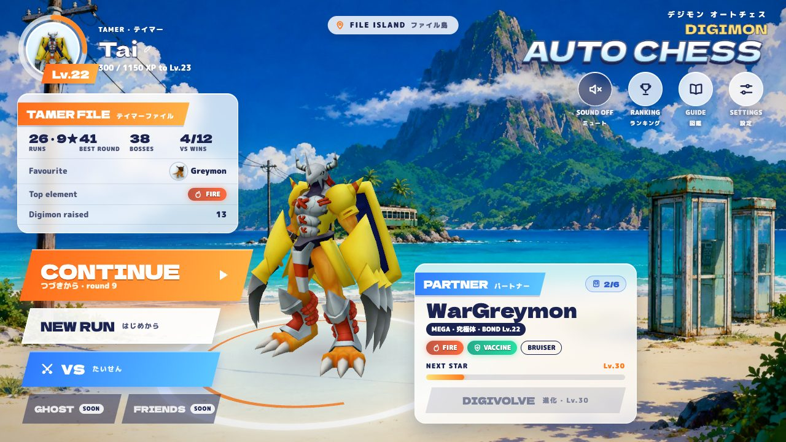
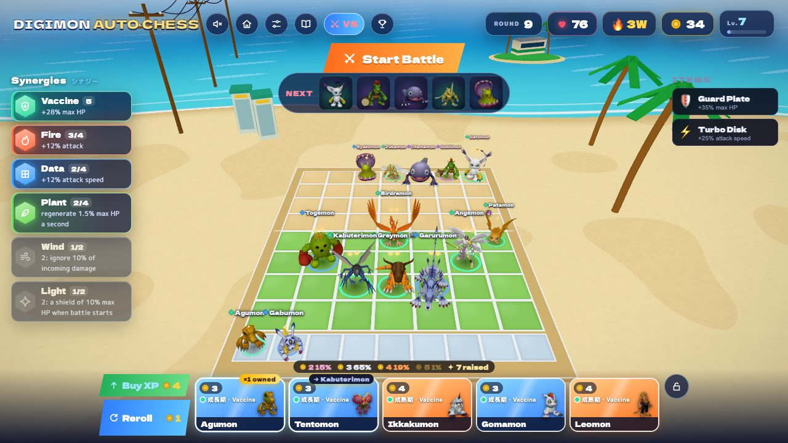
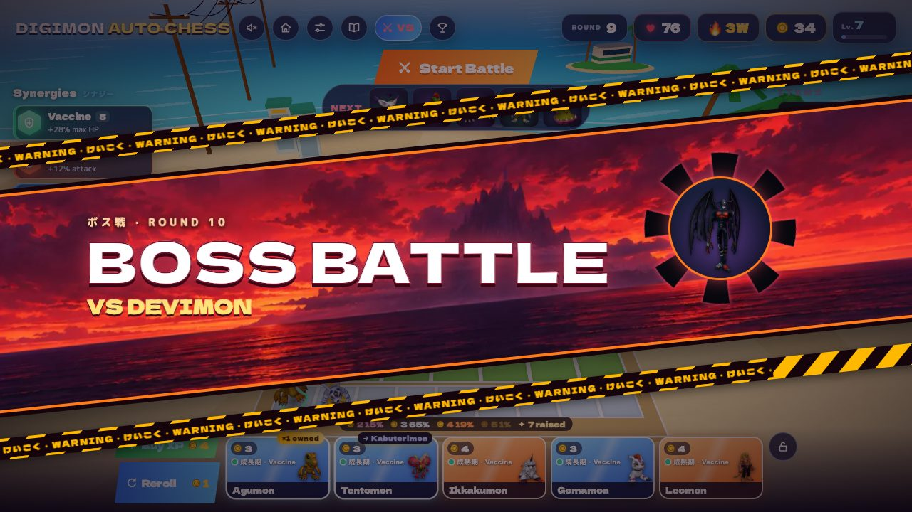
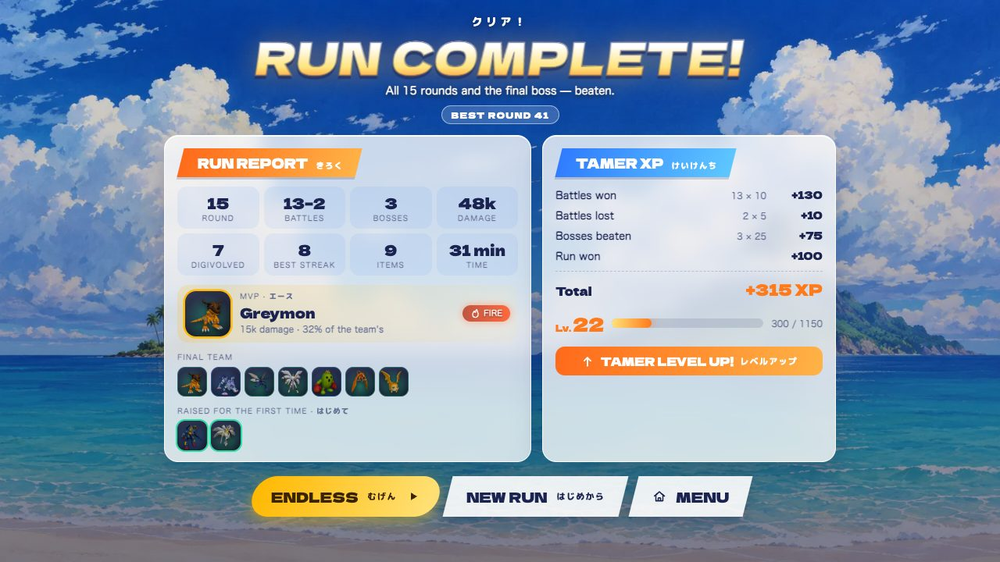

# Digimon Auto Chess

A browser auto battler in the Teamfight Tactics mould, themed on Digimon: raise your partners from babies —
Botamon → Koromon → Agumon, Guilmon or Dracomon → … — merging three copies into the next stage and choosing the
branch at each step, then watch your team fight on File Island's beach. The whole game is dressed as Digimon
Adventure (1999): an anime UI with Japanese call-outs, a V-Pet partner of your own and a soundtrack in the
series' mood. Plays on desktop and phones.
**Live: <https://digimon-autochess.pages.dev>** — mirror for networks that block `pages.dev` (Vodafone Ukraine's
DNS does): <https://digimon-autochess.askuznetsov6996.workers.dev>



<p align="center">
  
  
  
</p>

*Non-commercial fan project. Digimon and all related names belong to their owners; see [CREDITS.md](CREDITS.md)
for where the models, the art and the music come from.*

## What's in it

- **Digimon grow up from babies**: 284 forms in 48 lines on five stages — Fresh → In-Training → Rookie → Champion → Mega —
  following Digimon Story Cyber Sleuth's own evolution trees, plus 3 wild Digimon in the enemy waves and 7
  boss-only villains (Piedmon leads the other Dark Masters at VS round 40; Lucemon is the final boss, in two phases). Every one is an animated 3D model, with 242 named signature ultimates (Terra Force, Cocytus
  Breath, Positron Laser…).
- **Tiers where the price is the stage**: ⛂1 Fresh … ⛂5 Mega, levels 1–10 with level-based shop odds (hover the
  odds over the shop for the detail), and **discovery**: a Champion or Mega shows up in your shop only once you've
  raised one yourself that game. Raise or buy — that's the economy. A Mega has nowhere to digivolve, so three
  copies star it up: ★★, then ★★★ with a stronger ultimate.
- **Teamfight Tactics' board**: 7 × 4 cells a side and a bench of 9 — room for level 10, Digivices and raising
  several lines at once.
- **Synergies as in Cyber Sleuth**: three attributes in a counter triangle (Free babies stand outside it) and the
  game's eight elements — Fire, Water, Plant, Electric, Earth, Wind, Light, Dark — each fighting its own way:
  attack, mana, regeneration, attack speed, HP, a damage guard, a shield at the start, lifesteal. At four of an
  element it gets a mechanic of its own: Fire burns, Water keeps mana after a cast, Plant grows thorns, Electric
  chains lightning, Earth holds a last stand, Wind dodges every fourth attack, Light shields the most wounded ally
  on every cast, Dark halves the enemy's healing. Fresh babies have no element until a Digimental gives them one.
- **Items**: six base items and the rarer Digitama fuse in pairs — in the tray or right on a Digimon — into 28
  stronger ones: Adventure's Crests, Lightning Coil (every fifth attack strikes everything around the target),
  Spike Shell, Rage Chip, Blue Card…; Digitama + an item makes a **Digimental**, an emblem of an element, and two
  Digitama make a **Digivice**, one more Digimon on the board. Relics with no recipe counter freezes and healing.
- **Solo run**: a boss every fifth round, drawn from candidates so runs differ — among them Cyber Sleuth's data-eaters
  with mechanics of their own: the Eater devours your weakest Digimon and grows, the Mother Eater (endless) broods
  Eater Bits that shield her; round 15 is the final boss, Lucemon
  Falldown Mode, who rises again as Satan Mode when he falls — beat both to win, then keep going in endless mode.
- **VS for 2–8 players** — with friends over a 4-letter room code, or with strangers through a public
  matchmaking queue — in Teamfight Tactics' round rhythm: a round-robin of opponents (a ghost copy of someone's
  board for the odd one out), stages of five rounds with wild-Digimon rounds, a carousel item draft every stage
  (lowest HP picks first), three augment picks per match, a shared unit pool (what one player collects the
  others can't — a merged Digimon holds every copy that went into it), a boss every tenth round, loss damage that
  grows by stage, a planning timer, live scouting of any player's board, knockouts, places 1–8 and a rating.
  Reconnects survive a phone switching apps; play again in the same room. Copy the code or share an invite link
  (`?join=CODE` opens the game with it filled in). Ticks resolve simultaneously, so neither side ever acts first —
  a board against its own mirror is a draw.
- **A V-Pet partner on top of the auto chess**: hatch one of five Fresh in Primary Village and raise it on File
  Island — it greets you, reacts when you pet it and digivolves as it levels up with the XP you earn, into the
  branch you choose among those your play style points to (with Adventure's 「アグモン進化ー！」 call-out). Care
  for it like a V-Pet — feed it the meat you win in battles, pet it, train it; fullness and mood drift with real
  time, the bond grows over days — and a happy partner or a best friend earns you more XP. The partner at your
  side is your avatar; the **Digivice** holds up to six, so you can hatch another egg and call a
  resting one back. A tamer card keeps your records and Adventure's crests as achievements. Purely cosmetic: a
  partner never touches a fight.
- **Tamer XP paid at the end of a run**: a solo run counts its XP as you play — battles won and lost, bosses, the
  win — and pays it at game over or once round 15's final boss is fought (endless rounds earn none), on a **run
  report** over the island: rounds, battles, bosses, damage, digivolutions, items, time, the MVP, the final team,
  the Digimon raised for the first time, and the XP line by line with the level bar filling up.
- **Google accounts**: sign in on the title screen (or play as a guest) and your tamer, partners and run follow
  you to every device.
- **Friends**: a tamer code to share (adding one makes you friends both ways), who's online and doing what, one-tap
  JOIN into a friend's VS lobby or an INVITE to yours that pops up wherever they are; partners as avatars there and
  on the leaderboard.
- **Leaderboard and ghost battles** against other players' saved boards — season 2 since the tier rules — and a
  **ghost ladder**: your run's board fights a ghost from the same round (other tamers' boards, seeded with the
  bot's), an Elo rating and leagues from In-Training to Mega.
- **Primary Village mode** (an experiment): a Digimon that falls hatches again, in the same fight, as its line's baby.
- **Difficulty**: Easy, Normal or Hard for a new run — the enemies' strength, what a lost round costs and the tamer
  XP it pays (the bot wins about 80%, 42% and 15% of its runs).
- **Game feel**: shots and signature moves in their element (fireballs that shed embers, crackling bolts, water,
  leaves, rocks, wind crescents, light and shadow; an ultimate breathes its element at the target), hit-stop,
  camera shake, sparks, pooled damage numbers, a cinematic beat for Mega ultimates,
  "data deletion" deaths, a materialize-in at the start of every fight, and anime cut-ins — a boss walks in over
  a Black Gear dusk, the final battle opens under an eclipse.
- **A soundtrack made for the game**: ten instrumentals made with Suno in Digimon Adventure's mood (two takes each
  of *File Island*, *Digivolve!*, *Black Gears*, *Fallen Angel* and *Crest of Light*) crossfade with the mood of
  the moment; the sound effects are synthesized on the fly. A boss round's board turns to dusk, with Black Gears
  over the sea.
- **Tamer's Guide** (📖): the rules, the baby trees and every line with stats and ultimates (the Digimon tab is
  Izzy's Digimon Analyzer), synergies, item recipes and VS — generated from the game data, so it can't drift from
  the code.
- Quality-of-life: 2× battle speed, shop lock, hotkeys, drag-to-sell, damage meter, next-wave preview, tooltips,
  "→ Greymon" hints on shop cards that lead to a Digimon you have, a first-run tutorial, volume / graphics /
  reduced-motion and damage-number settings (by default only an ultimate's hits print big numbers; every hit,
  small and summed per unit, is a click away).

## How it's built

| Layer | Tech |
|---|---|
| UI and state | React 19, TypeScript, zustand |
| 3D | React Three Fiber (three.js 0.185), drei, postprocessing (HDR bloom, Neutral tone mapping) |
| Multiplayer, leaderboard, accounts, friends | Cloudflare Worker with Durable Objects (`Lobby`, `Matchmaker`, `Leaderboard`, `Account`, `Social`) |
| Sign-in | Google Identity Services; the worker checks the ID token (RS256 against Google's keys) and issues its own HMAC session |
| Hosting | Cloudflare Pages, long-lived immutable caching for hashed models and assets |

Design choices worth a look:

- **One deterministic simulation everywhere.** `src/game/battle.ts` steps combat at a fixed 0.05 s, with stable
  iteration order and `Math.sqrt` instead of `Math.hypot` (whose rounding differs between engines). The browser,
  every VS client and the balance bots run the exact same code — item mechanics included.
- **A lobby with no game server.** In VS, every client simulates *every* fight of the round from the same boards
  and reports the outcomes; the room (`server/src/lobby.ts`) applies the first report and compares the rest.
  Pairings, ghosts, places and rating are pure rules in `src/game/lobby.ts`, shared by the worker and the
  clients; `npm run lobbycheck` plays thousands of random lobbies through them. Every build is stamped with a hash
  of `src/game/` (`scripts/rules-version.mjs`, run by the site build and by the worker's build), and the worker
  lets a client into VS only on its own rules — a tab left open across an update reloads instead of simulating
  other fights, while a match already running when an update lands finishes on the rules it started with.
- **A test channel for new rules.** A build with `VITE_CHANNEL=v3` talks to its own worker (its own lobbies,
  queue and leaderboard), so a rules overhaul like the tiers was played on a separate address before it went live.
- **Cosmetics never touch the sim.** Hit-stop, slow motion and 2× speed only change *when* fixed steps run in
  real time (`src/three/juice.ts`), so replays and PvP results stay identical.
- **No per-tick React renders for units.** Each unit reads its fighter state in `useFrame` through a small mutable
  "drive" object; animation events (attack, cast, hit, death) are counters the model reacts to.
- **Models straight from the game files.** `scripts/dscs_setup.sh` unpacks a purchased copy of Digimon Story Cyber
  Sleuth (the Windows game, fetched on a Mac with SteamCMD) with MVGLTools; `scripts/dscs_convert.py` turns a model
  into glTF with its battle clips — no Blender: `scripts/dscs_to_glb.py` writes the glTF itself, baking the clips
  against the bind pose. `npm run optimize-models` turns the 476 MB of sources into 130 MB of meshopt-compressed,
  WebP-textured glTF with pruned clips, harmonized scale tracks and content-hashed URLs; `npm run check-models`
  validates all 294.
- **Models on demand.** 294 models are 130 MB — too much to fetch for everyone. The babies a run starts with load up front; after that
  the background only fetches what a player is about to see: what their units can digivolve into, the shop, the next
  wave and their VS opponents' boards (`src/three/models.ts`).
- **Bounded memory on phones.** A long endless run used to keep every model it had shown until iOS dropped the
  WebGL context (the screen blinked black). Models that aren't on screen or about to be are now released oldest
  first past a cap — 36 on touch devices — and fetched again from the HTTP cache if they come back.
- **Accounts that sync without clobbering.** The account carries what the game already keeps in localStorage.
  Every save names the version it was based on, so a device that missed a newer save gets a 409 and takes the
  newer copy, and the worker refuses saves from an older game than the last one to save, so a stale tab can't
  drop data it doesn't know about.
- **Presence without sockets.** Friends' online status and invites ride on a check-in every half a minute
  (`src/net/social.ts` → the `Social` object): one small request both says where you are and brings back your
  friends and invites — no socket per player held open.
- **Music that plays on an iPhone.** Neither host answers byte-range requests, which Safari's media loader needs,
  so each track is fetched whole and played from a blob through Web Audio, with a `playback` audio session so the
  silent switch doesn't mute it.
- **Japanese without the weight.** `scripts/jp-fonts.mjs` subsets the two Japanese fonts to the characters the UI
  actually uses at build time: 27 KB for both instead of about a megabyte per weight.
- **Rendered assets from the real scene.** Dev-only "studios" (`/?studio`, `/?studio=og`, `/?studio=icon`) render
  the 294 portraits, the link-preview image and the app icons with the game's own lighting.
- **Balance from data.** `npm run balance` runs thousands of scrims per form on all five stages (every form wins
  42–58%); `npm run runsim` has a bot play complete runs through the real store (shop odds, discovery, merges,
  economy, items, waves, bosses) to tune the difficulty curve — about half the runs beat each boss of the solo run.

## Run it

```bash
npm install
npm run dev            # Vite dev server
npm run build          # type-check + production build
npm run balance        # per-form win rates on every stage, role matrix, stage value, fight lengths
npm run runsim         # bot full-run simulator (runs=300 seed=1; dumpBoards=file for VS tuning)
npm run lobbycheck     # VS lobby rules: pairings, ghosts, knockouts, places, the shared pool
npm run optimize-models
npm run check-models
```

The worker lives in `server/` (`npx wrangler deploy --config server/wrangler.jsonc`); the site goes to Pages and to its
workers.dev mirror (`npm run deploy:mirror`, `site/wrangler.jsonc`). The test channel: `npm run deploy:worker:v3` and
`npm run deploy:v3`.

## Project docs

- [ROADMAP.md](ROADMAP.md) — audit, milestones and the work journal (in Ukrainian)
- [PVP-DESIGN.md](PVP-DESIGN.md) — Teamfight Tactics analysis and the plan for lobby-based PvP (in Ukrainian)
- [MODELS_CHECKLIST.md](MODELS_CHECKLIST.md), [models-src/README.md](models-src/README.md), [ASSETS.md](ASSETS.md) —
  the roster, model sourcing and the pipeline
- [CREDITS.md](CREDITS.md) — where every model comes from
