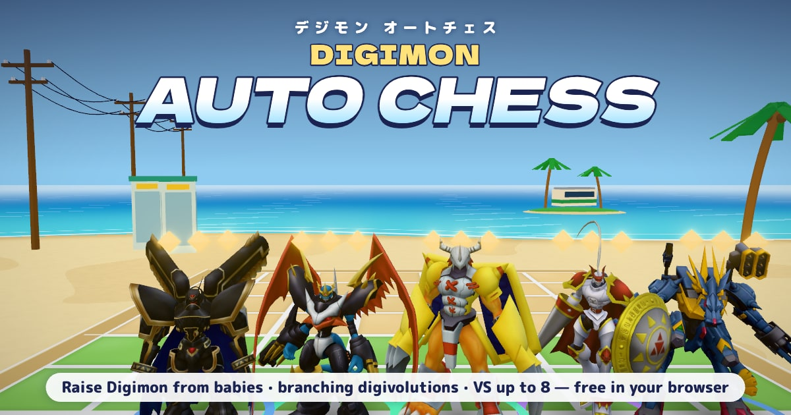

# Digimon Auto Chess

A browser auto battler in the Teamfight Tactics mould, themed on Digimon: buy rookies, merge three copies into a
Champion and then a Mega — choosing the branch at each step — and watch your team fight in a neon Digital World.
Plays on desktop and phones. **Live: <https://digimon-autochess.pages.dev>**



*Non-commercial fan project. Digimon and all related names belong to their owners; see [CREDITS.md](CREDITS.md)
for model sources.*

## What's in it

- **46 forms in 14 evolution lines**, every one an animated 3D model, with branching digivolutions and
  32 named signature ultimates (Terra Force, Cocytus Breath, Positron Laser…).
- **Synergies** (three attributes in a counter triangle, five families), **items** that fuse in pairs into
  12 stronger ones, boss rounds, a 15-round run plus endless mode.
- **VS a friend** over a 4-letter room code: deterministic battles both players simulate identically,
  reconnects that survive a phone switching apps, rematches in the same room.
- **Leaderboard and ghost battles** against other players' saved boards.
- **Game feel**: hit-stop, camera shake, sparks, pooled damage numbers, a cinematic beat for Mega ultimates,
  "data deletion" deaths, a materialize-in at the start of every fight.
- **Sound with no audio files**: weighty hits, ultimate stingers and a procedural synthwave soundtrack that
  shifts between prep, battle and boss rounds.
- Quality-of-life: 2× battle speed, shop lock, hotkeys, drag-to-sell, damage meter, next-wave preview,
  tooltips, first-run tutorial, volume / graphics / reduced-motion settings.

## How it's built

| Layer | Tech |
|---|---|
| UI and state | React 19, TypeScript, zustand |
| 3D | React Three Fiber (three.js 0.185), drei, postprocessing (HDR bloom, Neutral tone mapping) |
| Multiplayer, leaderboard | Cloudflare Worker with Durable Objects (`MatchRoom`, `Leaderboard`) |
| Hosting | Cloudflare Pages, long-lived immutable caching for hashed models and assets |

Design choices worth a look:

- **One deterministic simulation everywhere.** `src/game/battle.ts` steps combat at a fixed 0.05 s, with stable
  iteration order and `Math.sqrt` instead of `Math.hypot` (whose rounding differs between engines). The browser,
  both PvP clients and the balance bots run the exact same code; PvP clients compare an end-of-fight hash.
- **Cosmetics never touch the sim.** Hit-stop, slow motion and 2× speed only change *when* fixed steps run in
  real time (`src/three/juice.ts`), so replays and PvP results stay identical.
- **No per-tick React renders for units.** Each unit reads its fighter state in `useFrame` through a small mutable
  "drive" object; animation events (attack, cast, hit, death) are counters the model reacts to.
- **Model pipeline.** `npm run optimize-models` turns the source rips (101 MB) into 21 MB of meshopt-compressed,
  WebP-textured glTF with pruned animation clips, harmonized scale tracks and content-hashed URLs;
  `npm run check-models` validates all 46.
- **Rendered assets from the real scene.** Dev-only "studios" (`/?studio`, `/?studio=og`, `/?studio=icon`) render
  the 46 shop portraits, the link-preview image and the app icons with the game's own lighting.
- **Balance from data.** `npm run balance` runs thousands of scrims per form; `npm run runsim` has a bot play
  complete runs through the real store (shop odds, merges, economy, waves, bosses) to tune the difficulty curve —
  currently about 4 in 10 runs beat the round-15 boss.

## Run it

```bash
npm install
npm run dev            # Vite dev server
npm run build          # type-check + production build
npm run balance        # per-form win rates, role matrix, fight lengths
npm run runsim         # bot full-run simulator (runs=300 seed=1 variant=current)
npm run optimize-models
npm run check-models
```

The worker lives in `server/` (`npx wrangler deploy --config server/wrangler.jsonc`).

## Project docs

- [ROADMAP.md](ROADMAP.md) — audit, milestones and the work journal (in Ukrainian)
- [PVP-DESIGN.md](PVP-DESIGN.md) — Teamfight Tactics analysis and the plan for lobby-based PvP (in Ukrainian)
- [ASSETS.md](ASSETS.md), [MODELS_CHECKLIST.md](MODELS_CHECKLIST.md), [models-src/README.md](models-src/README.md) — model sourcing and pipeline
